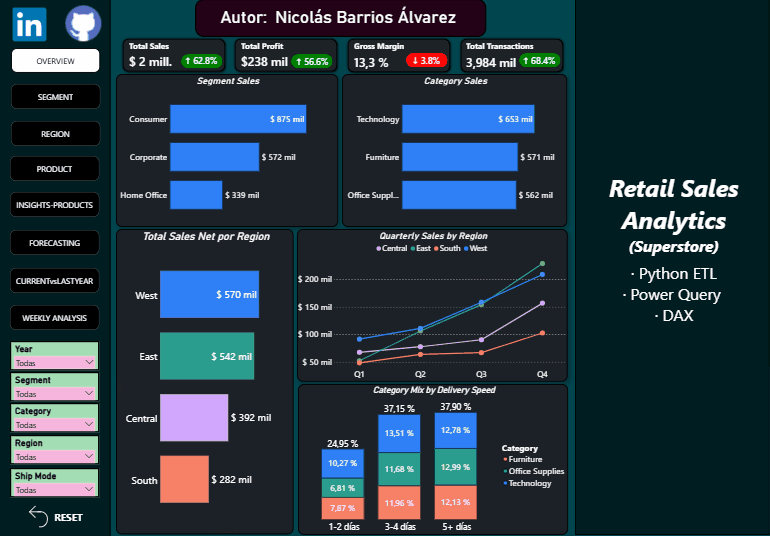
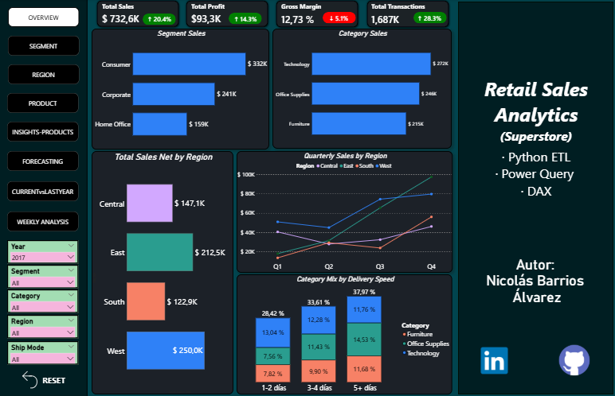
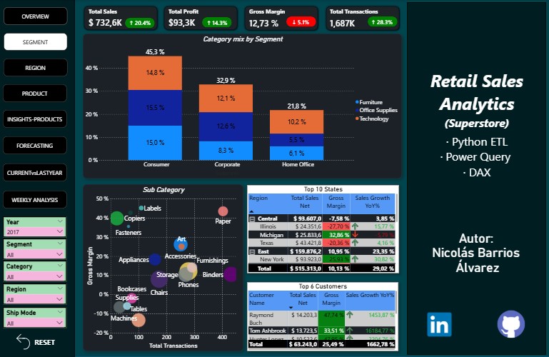
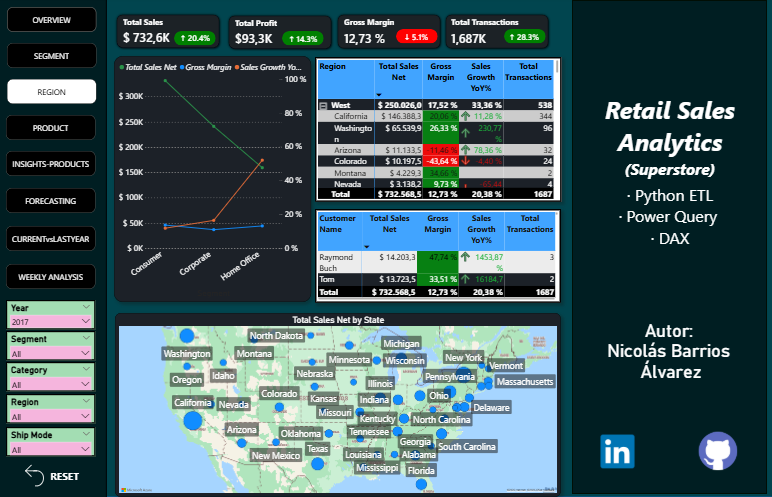
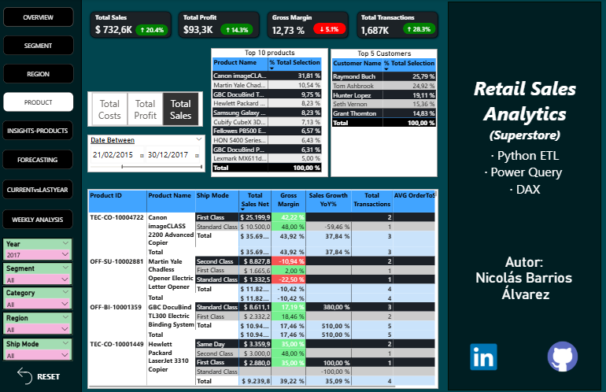
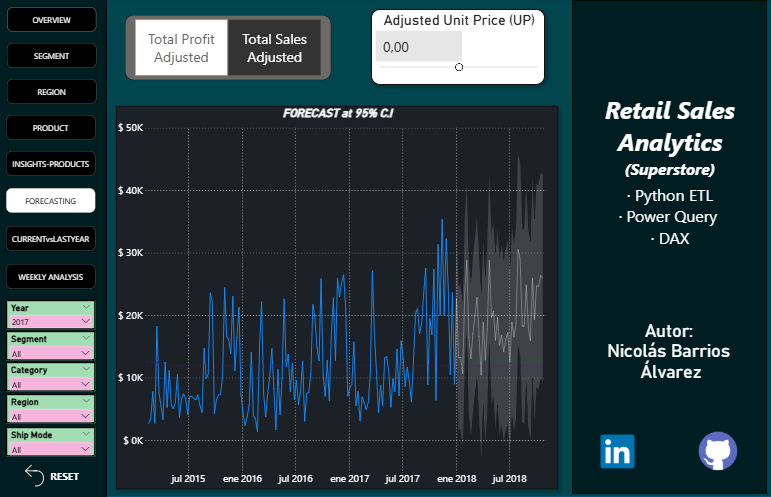
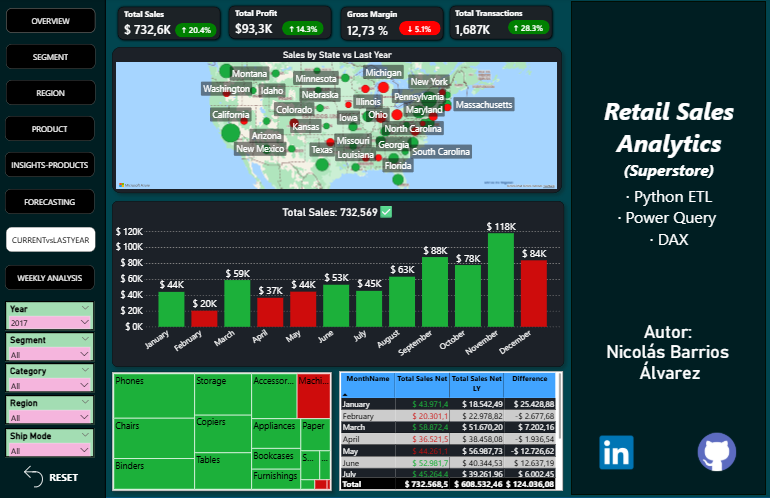

# 📊 Retail Sales Analytics — BI Dashboard con Pipeline ETL en Python

<p align="center">
  
</p>

<p align="center">
  
  
  
  
</p>

\---

## El proyecto

Las empresas con operaciones regionales rara vez reciben sus datos en un solo archivo limpio. Este proyecto simula exactamente eso: **5 archivos CSV independientes, uno por región**, que llegan con formatos inconsistentes, fechas mixtas y claves sin unificar.

El pipeline ETL los consolida, limpia y estructura automáticamente. El resultado alimenta un modelo dimensional en Power BI con más de 40 medidas DAX que permiten responder preguntas de negocio reales: ¿qué región tiene el mejor margen? ¿qué segmento creció más interanualmente? ¿cuál es la tendencia semanal de ventas netas?

\---

## Stack

|Capa|Tecnología|
|-|-|
|Extracción y transformación|Python · pandas · glob|
|Auditoría del proceso|Log automático con timestamp y conteo de filas|
|Modelado|Power Query · Star Schema (Kimball)|
|Análisis y KPIs|DAX — Time Intelligence, YoY, MoM, contextos dinámicos|
|Visualización|Power BI Desktop|

\---

## Pipeline ETL

El ETL está diseñado para ser **agnóstico a la cantidad de archivos**: detecta y carga dinámicamente todos los CSV disponibles en la carpeta de entrada, sin importar cuántos sean. En este caso procesa 5 archivos regionales (Central, East, South, West + consolidado).

**Extracción**

* Carga dinámica con `glob` — no requiere hardcodear nombres de archivos
* Soporte para encoding `utf-8-sig` y manejo de líneas con errores de parseo

**Transformación**

* Deduplicación por clave compuesta (`Order ID` + `Product ID` + `Customer ID`)
* Estandarización de fechas con `pd.to\_datetime` y detección de valores inválidos
* Normalización de texto: strip + title case para garantizar consistencia en dimensiones

**Carga**

* Exportación a CSV limpio como fuente directa para Power BI
* Generación automática de **log de auditoría** con timestamp, filas procesadas y columnas exportadas — trazabilidad completa del proceso

**Transformaciones complementarias en Power Query**

* Corrección de formatos numéricos y monetarios por configuración regional
* Depuración de pares ciudad–estado para garantizar unicidad geográfica
* Generación de surrogate keys e integración de dimensiones con FactSales mediante merges validados

\---

## Modelo de datos — Star Schema

```
         DimDate
            |
DimCustomer ─── FactSales ─── DimProduct
            |         |
      DimGeography  DimShipMode
```

**FactSales** contiene las métricas de negocio: `Sales`, `Profit`, `Quantity`, `Discount`, `Order Date`, `Ship Date` y las claves foráneas hacia cada dimensión.

Decisiones de modelado destacadas:

* `Categoría` y `Subcategoría` integradas en `DimProduct` — evita snowflake innecesario
* Surrogate keys en todas las dimensiones
* `DimDate` construida con DAX (`CALENDAR`) basada en el rango real de los datos
* Relaciones 1:\* con filtrado unidireccional
* Granularidad definida a nivel de línea de venta

\---

## DAX — más de 40 medidas

El modelo incluye medidas organizadas en **display folders** por función:

**Time Intelligence**
`Sales Growth YoY%` · `Sales Growth MoM%` · `Total Sales LM` · `Total Sales Net LY` · `Gross Margin LY` · `Total Transactions LY` · `YoY% Profit` · `YoY% Gross Margin`

**Métricas core**
`Total Sales Net` · `Total Profit` · `Total Costs` · `Gross Margin` · `AVG Unit Price` · `AVG OrderToShip Day` · `Total Transactions`

**Contexto dinámico**
`Total Selección Totales` · `Total Selección Totales Ajustados` · `Total Selección Totales Insights` — medidas con `ALLSELECTED` para mantener contexto correcto bajo cualquier combinación de filtros

**Formato condicional dinámico**
`CF for KPI Sales` · `CF for KPI Profit` · `CF for KPI Gross Margin` · `CF for KPI Total Transactions` — medidas DAX que controlan el color de los KPIs según el comportamiento del dato, sin depender de reglas estáticas

**Títulos dinámicos**
`Title Sales NOW vs LY` · `Title Week Analysis` — los títulos de los visuales cambian automáticamente según los filtros activos, mejorando la lectura del dashboard sin intervención manual

\---

## Dashboard — 6 pestañas

La navegación se gestiona con **bookmarks, botones interactivos y un reset de filtros global**.

|Pestaña|Qué responde|
|-|-|
|Overview|Vista ejecutiva: ventas, margen, transacciones y tendencias por región y categoría|
|Segment|Desempeño por segmento de cliente con drill-down a estado y cliente|
|Region|Análisis geográfico detallado con comparativa interanual|
|Product|Rentabilidad por categoría, subcategoría y producto|
|Forecasting|Proyección de ventas con bandas de confianza|
|Current vs Last Year|Comparativa directa período a período con variaciones|

\---

## Lo que aprendí construyendo esto

Dos cosas que no sabía antes de este proyecto y que cambiaron cómo pienso el diseño de dashboards:

Los **títulos dinámicos en DAX** permiten que el visual comunique solo con texto qué está mostrando en cada momento — sin que el usuario tenga que interpretar el estado de los filtros. Y las **medidas de formato condicional** hacen que los KPIs respondan visualmente al dato, no a un umbral fijo: el color es parte del análisis, no decoración.

El mayor reto técnico fue construir tablas con múltiples variables manteniendo coherencia visual dentro del tema oscuro del dashboard — Power BI tiene limitaciones reales en formato condicional de subtotales que requieren soluciones DAX específicas.

\---

## Estructura del repositorio

```
📁 retail-sales-analytics/
├── 📁 data/
│   ├── raw/          # 5 CSVs regionales originales
│   └── processed/    # Output del ETL
├── 📁 etl/
│   ├── extract.py
│   ├── transform.py
│   ├── load.py
│   └── audit\_log/    # Logs automáticos con timestamp
├── 📁 screenshots/   # Capturas de las 6 pestañas
├── RetailSalesAnalytics.pbix
├── Dashboard.gif
└── README.md
```

\---

## \# 📊 Retail Sales Analytics — BI Dashboard con Pipeline ETL en Python

## 

## <p align="center">

## &#x20; 

## </p>

## 

## <p align="center">

## &#x20; 

## &#x20; 

## &#x20; 

## &#x20; 

## </p>

## 

## \---

## 

## \## 🚀 Executive Summary

## 

## Pipeline ETL automatizado en Python que consolida múltiples fuentes regionales de ventas, las transforma bajo estándares analíticos y alimenta un dashboard ejecutivo en Power BI construido sobre modelo estrella.

## 

## El proyecto integra:

## 

## \- \*\*Automatización ETL\*\*

## \- \*\*Modelado dimensional\*\*

## \- \*\*Más de 40 medidas DAX\*\*

## \- \*\*Análisis comparativo interanual\*\*

## \- \*\*Visualización ejecutiva orientada a decisión\*\*

## 

## Permite responder preguntas de negocio como:

## 

## \- ¿Qué región presenta mejor rentabilidad?

## \- ¿Qué segmento muestra mayor crecimiento?

## \- ¿Cómo evoluciona el margen semanalmente?

## \- ¿Qué productos impulsan el beneficio?

## 

## \---

## 

## \## 🛠 Stack Tecnológico

## 

## | Capa | Tecnología |

## |------|------------|

## | Extracción y transformación | Python · pandas · glob |

## | Auditoría | Logs automáticos con timestamp |

## | Modelado | Power Query · Star Schema |

## | Análisis | DAX · Time Intelligence |

## | Visualización | Power BI Desktop |

## 

## \---

## 

## \## ⚙️ Pipeline ETL

## 

## El pipeline detecta dinámicamente todos los archivos CSV disponibles y procesa automáticamente múltiples fuentes sin hardcodear nombres.

## 

## \### Extracción

## 

## \- Carga dinámica con `glob`

## \- Compatibilidad con `utf-8-sig`

## \- Manejo de errores de parseo

## 

## \### Transformación

## 

## \- Deduplicación por clave compuesta

## \- Estandarización de fechas con `pd.to\_datetime`

## \- Normalización textual para consistencia dimensional

## 

## \### Carga

## 

## \- Exportación de dataset limpio

## \- Log automático de auditoría

## \- Trazabilidad completa del proceso

## 

## \### Transformaciones adicionales

## 

## \- Corrección regional de formatos

## \- Validación geográfica

## \- Integración dimensional mediante merges validados

## 

## \---

## 

## \## 🧠 Modelo de Datos

## 

## ```text

## &#x20;        DimDate

## &#x20;           |

## DimCustomer ─── FactSales ─── DimProduct

## &#x20;           |         |

## &#x20;     DimGeography  DimShipMode

## ```

## 

## \### Decisiones de modelado

## 

## \- Modelo estrella optimizado

## \- Surrogate keys

## \- Relaciones 1:\*

## \- Filtrado unidireccional

## \- Granularidad a nivel transaccional

## 

## \---

## 

## \## 📈 Análisis DAX

## 

## Más de \*\*40 medidas analíticas\*\* organizadas por funcionalidad.

## 

## \### Time Intelligence

## 

## YoY · MoM · LY · Growth %

## 

## \### KPIs Core

## 

## Ventas · Profit · Costos · Margen

## 

## \### Contexto dinámico

## 

## Medidas con `ALLSELECTED`

## 

## \### Formato condicional inteligente

## 

## KPIs que responden visualmente al comportamiento real del dato

## 

## \### Títulos dinámicos

## 

## Visuales adaptativos según filtros activos

## 

## \---

## 

## \## 📊 Funcionalidades del Dashboard

## 

## | Vista | Objetivo |

## |------|---------|

## | Overview | KPIs ejecutivos |

## | Segment Analysis | Rendimiento por cliente |

## | Region Analysis | Desempeño geográfico |

## | Product Analysis | Rentabilidad por producto |

## | Forecasting | Proyección de ventas |

## | Current vs Last Year | Comparativo interanual |

## | Weekly Analysis | Evolución semanal |

## 

## \---

## 

## \## 💡 Principales aprendizajes

## 

## Implementé lógica avanzada en DAX para construir visuales contextuales capaces de comunicar automáticamente el estado analítico del dashboard.

## 

## También resolví limitaciones nativas de formato en Power BI mediante medidas personalizadas para mantener consistencia visual, legibilidad y precisión analítica en entornos complejos.

## 

## \---

## 

## \## 📁 Estructura del Repositorio

## 

## ```text

## retail-sales-analytics/

## ├── Dataset Superstore/

## ├── Screenshots/

## ├── Dashboard Inteligencia Comercial.pbix

## ├── Dashboard.gif

## └── README.md

## ```

## 

## \---

## 

## \# 📸 Dashboard Screenshots

## 

## <h2>Overview</h2>

## 

## 

## <h2>Segment Analysis</h2>

## 

## 

## <h2>Region Analysis</h2>

## 

## 

## <h2>Product Analysis</h2>

## 

## 

## <h2>Insights Products</h2>

## 

## 

## <h2>Forecasting</h2>

## 

## 

## <h2>Current vs Last Year</h2>

## 

## 

## <h2>Weekly Analysis</h2>

## 

## 

## \---

## 

## <p align="center">

## &#x20; <strong>Nicolás Barrios Álvarez</strong><br/>

## &#x20; Data Analyst | BI Developer | Reporting Analyst

## </p>

## 

## <p align="center">

## &#x20; <a href="TU\_LINKEDIN">LinkedIn</a> •

## &#x20; <a href="TU\_GITHUB">GitHub</a>

## </p>

